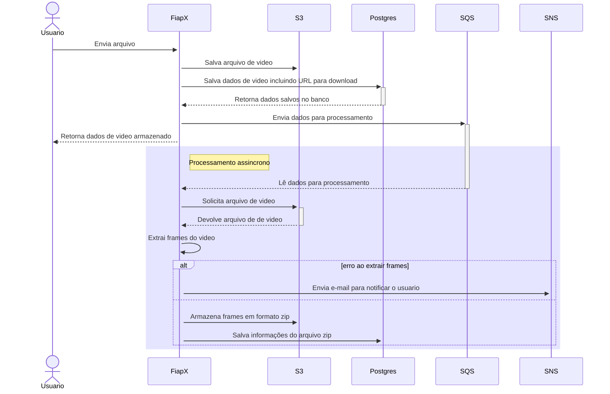

# Video Frame Extractor API - Fiap-X

API para extração de frames de vídeos com processamento assíncrono e armazenamento em S3.

## Funcionalidades  
1. Recebe vídeos via REST API.  
2. Processa extração de frames em filas SQS.  
3. Armazena o vídeo original e o arquivo ZIP com os frames no bucket S3.  
4. Salva metadados no banco PostgreSQL.  
5. Envia notificações de erro por e-mail via SNS.  

## Tecnologias  
- **Linguagem**: Kotlin  
- **Framework**: Spring Boot
- **Banco de Dados**: PostgreSQL  
- **Armazenamento**: AWS S3  
- **Mensageria**: AWS SQS  
- **Notificações**: AWS SNS
- **Autenticação**: Cognito

## Como usar  
1. Faça uma chamada REST enviando um vídeo no payload.
    ```bash
      curl -XPOST "http://localhost:8080/videos"
      -F "@videos=/caminho/para/video.mp4
    ```
3. A API processa o vídeo e extrai os frames.  
4. Os arquivos gerados podem ser acessados via URLs armazenadas no banco.  

## Endpoints principais
- `POST /videos` - Enviar vídeo para processamento.
- `GET /videos` - Obter uma lista de todos os videos.
- `GET /videos/{id}` - Obter status do processamento e links dos arquivos gerados.

> [!IMPORTANT]
> Todos os endpoints estão documentados através do Swagger

## Pré-requisitos  
- Docker e Docker Compose.  
- Configurações de acesso à AWS (S3, SQS, SNS).  

## Instalação  
1. Clone o repositório:  
    ```bash
    git clone <repo_url>
    cd <repo_folder>
    ```
2. Configure as variáveis de ambiente nos arquivos de `application.properties`.
3. Suba o ambiente com Docker Compose:
    ```bash
    docker-compose up --build
    ```

## Diagrama de sequência



## Diagrama de arquitetura 


## Repositório dos recursos AWS

API Gateway: https://github.com/Tech-Challenge-7SOAT/api-gateway-fiap-x

ECS: https://github.com/Tech-Challenge-7SOAT/ecs-fiap-x

RDS: https://github.com/Tech-Challenge-7SOAT/rds-fiap-x

S3: https://github.com/Tech-Challenge-7SOAT/s3-fiap-x

SNS: https://github.com/Tech-Challenge-7SOAT/sns-fiap-x

SQS: https://github.com/Tech-Challenge-7SOAT/sqs-fiap-x